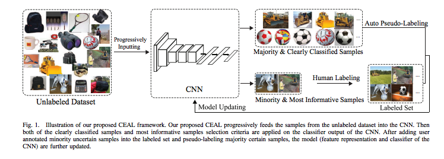

# CEAL
Pytorch implementation of Cost-Effective Active Learning for Deep Image Classification paper

# Difference from the original paper

1. Image input : 224 x 224 instead of 227 x 227

2. Learning rate: 0.001 for all layers.

3. Freeze all the layers except the last one.

4. Experiments done only on Caltech256.

5. No comparison to other methods.

# How to use  the code
1. Install conda environment `conda env create -f environment.yml`
2. Download Caltech256  from [caltech256](https://www.kaggle.com/jessicali9530/caltech256)
3. Run scripts `divide_data.sh` to divide data into test and train
4. main_program `run_ceal/ceal_learning_algorithm.py`

# References:
Some code is modified from this [repo](https://github.com/dhaalves/CEAL_keras/blob/master/CEAL_keras.py) 

